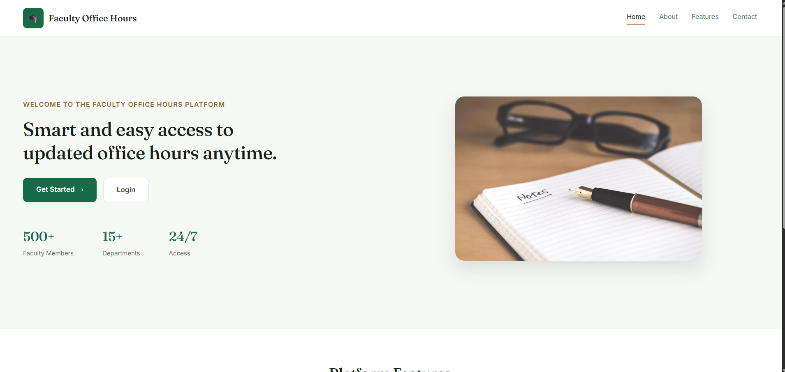
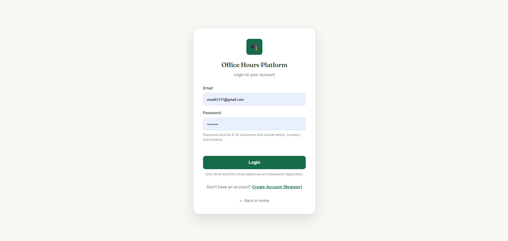
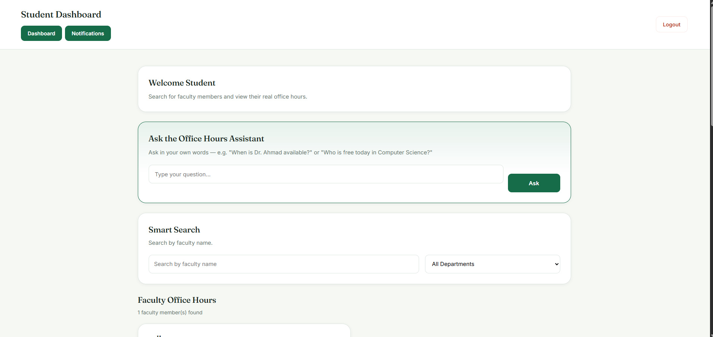
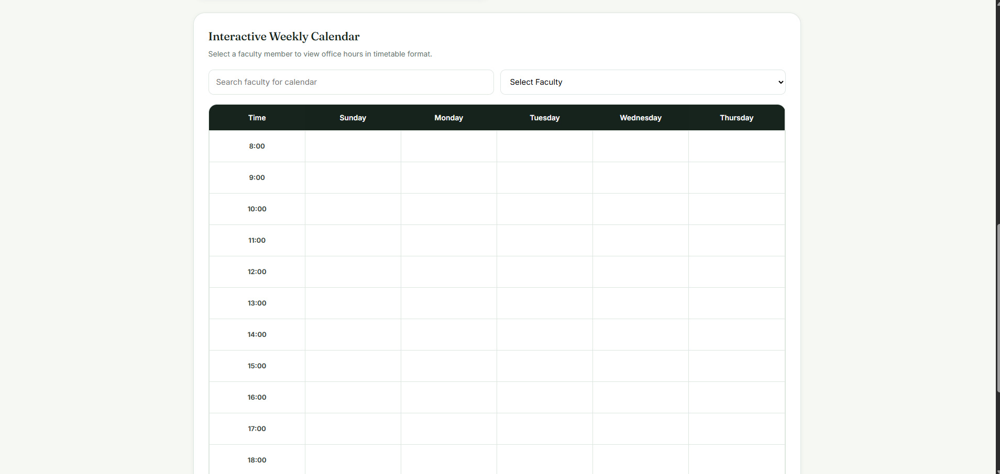
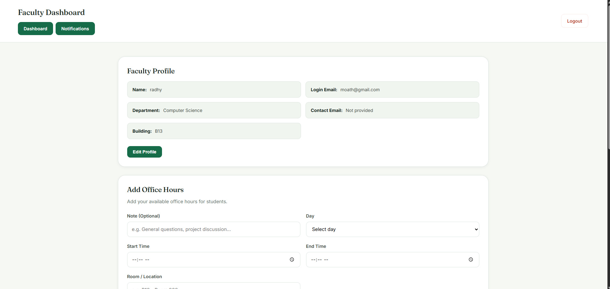
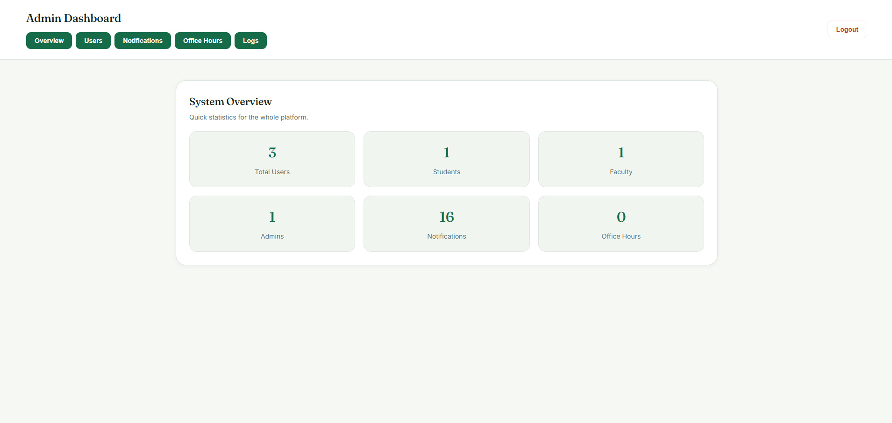

# 🎓 Faculty Office Hours Management Platform

A web platform that centralizes faculty office hours for a university department — built to replace outdated printed schedules and unanswered emails with a live, searchable, role-based system.

**🔗 Live demo:** https://faculty-office-hours.web.app


---

## 📖 About

Students often have no reliable way to know when an instructor is actually available — printed schedules go out of date, and a wasted trip to a closed office is a common frustration. This platform gives every faculty member a live, editable schedule, gives students a fast way to find and understand it, and gives administrators full oversight — all with real-time updates and no manual coordination required.

Originally built as a graduation project at King Khalid University, College of Computer Science, then rebuilt and extended independently with production-grade security rules, a redesigned UI, conflict detection, and a natural-language assistant.

---

## ✨ Key Features

### For Students
- **Ask the Office Hours Assistant** — a rule-based natural language engine (no external AI API, zero cost) that answers free-form questions like *"When is Dr. Ahmad available?"* or *"Who is free today in Computer Science?"* in English or Arabic, by extracting the faculty name, weekday, and department from the sentence and reasoning over the live schedule data.
- **Smart fuzzy search** (Fuse.js) — finds the right instructor even with typos or partial names.
- **Interactive weekly calendar** — visual, color-coded timetable of any faculty member's office hours.

### For Faculty
- **Self-service schedule management** — add, edit, and delete office hours without contacting an administrator.
- **Automatic conflict detection** — before saving a new slot, the system checks for:
  - a **room conflict**, if another faculty member already booked that room at an overlapping time,
  - a **self conflict**, if the same faculty member already has an overlapping slot elsewhere (can't be in two places at once),
  - and if a conflict is found, it **suggests the next available time slot** in that room automatically.

### For Admins
- Full user and role management (promote/demote student, faculty, admin — safely, see [Security](#-security) below)
- Manual and automatic notification feed
- System-wide office hours oversight
- Action logs for accountability

---

## 📸 Screenshots

| Homepage | Login |
|---|---|
|  |  |

| Student Dashboard + AI Assistant | Weekly Calendar |
|---|---|
|  |  |

| Faculty Dashboard | Admin Dashboard |
|---|---|
|  |  |

---

## 🛠 Tech Stack

| Layer | Technology |
|---|---|
| Frontend | HTML5, CSS3 (custom design system with CSS variables), Vanilla JavaScript |
| Backend | Firebase Authentication, Cloud Firestore |
| Hosting | Firebase Hosting |
| Search | Fuse.js (fuzzy matching) |
| NLU Engine | Custom rule-based intent/entity extraction (see `student.js`) |

No frameworks, no build step — the entire frontend runs as static files, which keeps the project easy to read, deploy, and extend.

---

## 🗂 Data Model (Cloud Firestore)

| Collection | Purpose | Key Fields |
|---|---|---|
| `users` | Account profile + role | `name`, `email`, `role` (`student` / `faculty` / `admin`), `department` |
| `officeHours` | One document per scheduled slot | `userId`, `day`, `time`, `room`, `note` |
| `notifications` | Manual + automatic activity feed | `message`, `type`, `createdAt` |
| `logs` | Admin action audit trail | `adminEmail`, `action`, `target`, `createdAt` |

---

## 🔒 Security

Access is enforced server-side with Firestore Security Rules (`firestore.rules`), not just in the UI:

- A user can **never set their own role to `admin`** on creation or update — role changes must come from an existing admin. This closes a common privilege-escalation gap in student projects that store roles in an unrestricted user document.
- Faculty can only create or modify office hours under their **own** `userId`.
- Every collection defaults to **deny** unless explicitly allowed.

---

## 🚀 Running It Locally

```bash
git clone https://github.com/muathhhh/Faculty-Office-Hours-Platform.git
cd Faculty-Office-Hours-Platform
```

1. Create a Firebase project at [console.firebase.google.com](https://console.firebase.google.com)
2. Enable **Authentication** (Email/Password) and **Firestore Database**
3. Replace the config in `firebase-config.js` with your own project's config
4. Deploy the included `firestore.rules`
5. Serve the folder with any static server, or deploy with:

```bash
npm install -g firebase-tools
firebase login
firebase deploy
```

---

## 🗺 Roadmap

- [ ] Natural-language office hours entry for faculty (extend the existing NLU engine to parse free-text schedule input)
- [ ] Live "available now" status badge on faculty cards
- [ ] Per-faculty QR code linking to a live status page
- [ ] Digital queue system for high-traffic periods (e.g. exam weeks)
- [ ] `.ics` calendar export for students
- [ ] Mobile app wrapper

---

## 👤 Author

**Muath Mohammad**
Computer Science (AI) graduate, King Khalid University
[LinkedIn](https://linkedin.com/in/muath-sufani-592a6a417) · [GitHub](https://github.com/muathhhh)

---

## 📄 License

This project is available under the MIT License.
